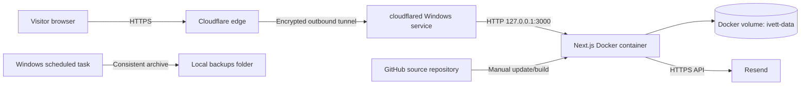

# Technical deployment guide

This document describes the production deployment of the Ivett Kovacs PMU reservation service on a Windows laptop. The application source is stored in GitHub, while the live database, uploaded images, credentials, and backups remain on the laptop.

## Architecture



### Components

| Component | Purpose | Persistence / exposure |
| --- | --- | --- |
| Next.js standalone server | Public website, booking API, and admin interface | Runs in the `ivett-web-1` Docker container |
| SQLite and uploaded files | Reservations, configuration, gallery uploads, and admin state | Stored in the `ivett_ivett-data` Docker volume |
| Docker Desktop | Builds and runs the application | Starts after the Windows user signs in |
| `cloudflared` | Connects Cloudflare to the local server without inbound router ports | Automatic Windows service |
| Cloudflare | Public DNS, HTTPS certificate, reverse proxy, and tunnel endpoint | Free plan; authoritative DNS for the domain |
| Resend | Request receipts, status emails, and password recovery mail | Credentials supplied through the ignored `.env` file |
| Windows Task Scheduler | Runs the daily data backup | Daily at 03:00, with missed runs started when available |
| GitHub | Versioned application and deployment scripts | Contains no production secrets or customer data |

## Network and security boundaries

- Docker publishes the application only on `127.0.0.1:3000`. It is not directly reachable from another computer.
- `cloudflared` makes outbound connections to Cloudflare. Router port forwarding is not required.
- Visitors connect to `https://www.ivettkovacspmu.hu`. Cloudflare terminates public HTTPS and forwards the request through the encrypted tunnel.
- The local hop from `cloudflared` to Docker is `http://127.0.0.1:3000`, confined to the laptop.
- `PUBLIC_ORIGIN` must exactly match the public origin. It controls origin checks, secure cookies, and password-recovery links.
- The admin password is stored as a password hash in the persistent database. The initial `admin` / `admin` password must be changed before public exposure.
- `.env`, the Docker volume, `backups/`, and `work/` are excluded from Git.

## Initial deployment

### 1. Prepare Windows and Docker

Install WSL 2 and Docker Desktop with its WSL 2 engine. Start Docker Desktop and wait until the engine is ready. From the repository directory, build and start the web service:

```powershell
cd 'C:\Users\Kovács Márk\Desktop\Ivett'
docker compose -f compose.yaml up -d --build web
docker compose -f compose.yaml ps
```

The expected result is one healthy `web` container bound to `127.0.0.1:3000`.

### 2. Configure private environment values

Create an ignored `.env` file beside `compose.yaml`:

```dotenv
PUBLIC_ORIGIN=https://www.ivettkovacspmu.hu
RESEND_API_KEY=
RESEND_FROM="Ivett Kovacs PMU <foglalas@ivettkovacspmu.hu>"
ADMIN_RECOVERY_EMAIL=
TUNNEL_TOKEN=
```

Do not commit this file. Restart the container after changing application environment values:

```powershell
docker compose -f compose.yaml up -d --no-deps web
```

### 3. Initialize the application

Open `http://127.0.0.1:3000/admin`, sign in with the one-time `admin` / `admin` credentials, and change the password. Review services, prices, durations, weekly hours, unavailable periods, contact details, FAQ, gallery, and legal pages.

### 4. Move DNS to Cloudflare

Add `ivettkovacspmu.hu` to a Cloudflare Free account. Before changing nameservers, copy every existing record from Websupport, with particular attention to:

- Websupport MX records;
- the SPF TXT record;
- the DMARC TXT record;
- the Resend DKIM TXT record;
- `rsend` and `send` Resend CNAME records;
- any ownership-verification records.

Disable DNSSEC at the registrar before replacing nameservers. Change the Websupport delegation to the two nameservers assigned by Cloudflare. After Cloudflare reports the zone as active, re-enable DNSSEC through Cloudflare if desired.

### 5. Create and install the tunnel

In Cloudflare, create a remotely managed tunnel named for this laptop. Copy the tunnel token into `.env` as `TUNNEL_TOKEN`. Run the prepared installer from Administrator PowerShell:

```powershell
powershell.exe -NoProfile -ExecutionPolicy Bypass -File "C:\Users\Kovács Márk\Desktop\Ivett\scripts\install-tunnel-service.ps1"
Get-Service cloudflared
```

The service should be `Running` with automatic startup. The installer stores the token in Cloudflare's protected service-token location and does not print it.

### 6. Publish the application

Inside the tunnel, add a **Published application** route:

| Setting | Value |
| --- | --- |
| Hostname | `www.ivettkovacspmu.hu` |
| Service URL | `http://127.0.0.1:3000` |

The corresponding Cloudflare DNS record must be a proxied CNAME named `www` whose target is `<TUNNEL-ID>.cfargotunnel.com`. Remove conflicting `www` A and AAAA records that point to the old Websupport site.

Use a Cloudflare redirect rule if the bare `.hu` domain should redirect to `https://www.ivettkovacspmu.hu`. Configure the `.com` domain separately and redirect both its bare and `www` names to the primary `.hu` URL.

### 7. Configure Resend

Verify the sender domain in Resend and confirm its DNS records resolve from Cloudflare. Create a sending API key and place it in `.env`. Set `RESEND_FROM` to a sender on the verified domain and `ADMIN_RECOVERY_EMAIL` to the private recovery inbox. Restart the container.

The application creates a durable email outbox entry in the same transaction as a reservation. It sends an immediate request receipt, then a separate email after an admin confirmation, cancellation, or rejection. A request receipt explicitly states that the appointment is still pending.

### 8. Enable startup and backups

Register Docker Desktop to start when this Windows user signs in:

```powershell
powershell.exe -NoProfile -ExecutionPolicy Bypass -File .\scripts\register-startup.ps1
```

Create and test a backup, then register the daily task:

```powershell
powershell.exe -NoProfile -ExecutionPolicy Bypass -File .\scripts\backup-windows.ps1
powershell.exe -NoProfile -ExecutionPolicy Bypass -File .\scripts\register-backup-task.ps1
```

The backup script stops only the web container, archives the complete data volume, verifies the archive, writes a SHA-256 sidecar, restarts the container in a `finally` block, and removes local archives older than 14 days.

## Routine operation

### Health checks

```powershell
docker compose -f compose.yaml ps
docker compose -f compose.yaml logs --tail 100 web
Get-Service cloudflared
Get-ScheduledTaskInfo -TaskName 'Ivett Reservation Backup'
```

Verify the public application rather than checking only the HTTP status:

```powershell
curl.exe -I https://www.ivettkovacspmu.hu/
curl.exe https://www.ivettkovacspmu.hu/api/catalog
```

The catalog endpoint should return JSON. A `200` response containing a Websupport placeholder means DNS still targets the old hosting service.

### Application update

Create a backup before every update. Pull the reviewed source and rebuild only the web service:

```powershell
cd 'C:\Users\Kovács Márk\Desktop\Ivett'
powershell.exe -NoProfile -ExecutionPolicy Bypass -File .\scripts\backup-windows.ps1
git pull --ff-only origin main
docker compose -f compose.yaml up -d --build --no-deps web
docker compose -f compose.yaml ps
```

The named volume is retained when the container is recreated. Never use `docker compose down -v` unless deleting all production data is intentional.

### Restore drill

Restore a backup into a new disposable Docker volume first. Confirm that SQLite opens and the expected tables exist before considering a production restore. Stop the application before replacing production data, and preserve the current volume until the restored copy is verified.

## Troubleshooting

| Symptom | Likely cause | Resolution |
| --- | --- | --- |
| Public URL displays a Websupport placeholder | `www` still has old A/AAAA records | Remove the conflicting `www` A/AAAA records and use the proxied tunnel CNAME |
| Cloudflare error 1016 | Tunnel DNS record exists, but the tunnel is unavailable | Check `Get-Service cloudflared`, restart the service, and verify the tunnel token |
| Cloudflare error 502 | Tunnel is connected but cannot reach the local application | Check Docker health and confirm the route uses `http://127.0.0.1:3000` |
| Site works locally but booking POST returns 403 | `PUBLIC_ORIGIN` does not exactly match the browser origin | Set it to `https://www.ivettkovacspmu.hu` and recreate the web container |
| HTTPS works but the wrong site appears | Cloudflare is proxying an old DNS origin | Inspect Cloudflare DNS; the `www` record must target the tunnel CNAME |
| Tunnel installer reports `NativeCommandError` | Older script treated Cloudflare informational stderr as a PowerShell error | Pull the current script and rerun it from Administrator PowerShell |
| Tunnel service is installed but stopped | The first installer run ended before `Start-Service` | Rerun `install-tunnel-service.ps1` from Administrator PowerShell |
| No request or confirmation email | Resend variables are missing, sender domain is unverified, or DNS records were lost | Check `.env`, restart the container, verify Resend status, and restore DKIM/SPF/CNAME records in Cloudflare |
| Incoming domain mail stops after nameserver change | MX/SPF/DKIM/DMARC records were not copied | Restore the original mail records in Cloudflare DNS as DNS-only records |
| Docker does not start after reboot | Docker Desktop starts only after user sign-in | Sign in, verify the Startup shortcut, and enable Docker Desktop startup settings |
| Website disappears while the laptop sleeps | Windows suspended the host | Configure the laptop to remain awake while plugged in |
| Backup task reports success but no archive appears | Scheduled user cannot access Docker or the project path | Run the script interactively, inspect Task Scheduler history, and keep the task under the Docker-enabled Windows user |
| Disk space becomes low | Docker images and retained backups accumulate | Remove unused Docker build cache carefully, shorten local retention if needed, and move verified backups off-device |
| Gallery image redirects to `0.0.0.0` | An old application image is still running | Pull the current code and rebuild the web container |

## Recovery priorities

1. Keep the `.env` secrets in a password manager or encrypted off-device backup.
2. Copy verified data archives to a separate disk or remote backup target. Local-only backups do not protect against laptop or disk loss.
3. Preserve access to the Cloudflare, Websupport, Resend, and GitHub accounts with recovery methods and multi-factor authentication.
4. Keep the Docker volume and the Git repository separate: Git restores the application, while the volume backup restores bookings and uploaded content.

## Related documents

- [WINDOWS_HOSTING.md](WINDOWS_HOSTING.md) contains the concise operator checklist for this laptop.
- [SELF_HOSTING.md](SELF_HOSTING.md) describes the application hosting modes and data model at a higher level.
- [DOMAIN_SETUP.md](DOMAIN_SETUP.md) archives the inactive static GitHub Pages alternative; do not combine its old website DNS records with the tunnel route.
